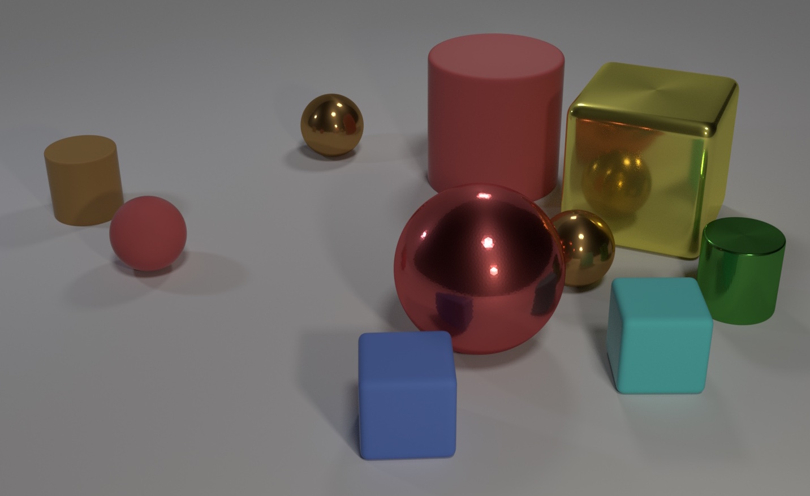
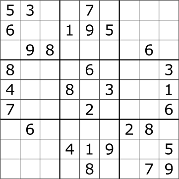
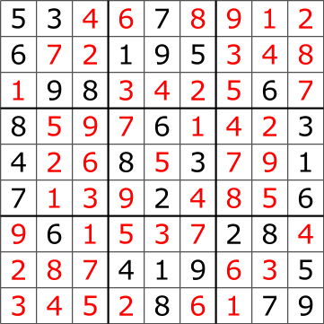

## Relational Reasoning

Consider the image above.
It's almost impossible to not think of this as the objects (spheres, cubes, etc.) in the image.
We could think of it in terms of the millions of numbers that make up the pixel values of the image.
Or the angles of all the edges in the image.
Or consider each 10x10 pixel region.
But we don't.
Instead we intuitively recognize the objects and reason about the image in terms of them.

Try to answer the following question:
*" What size is the cylinder that is left of the brown metal thing that is left of the big sphere?"*
This is an example question from the [CLEVR](http://cs.stanford.edu/people/jcjohns/clevr/) dataset.
In order to answer it you need to consider the relative position of the objects with respect to each other.
This object and interaction centric thinking is called relational reasoning and it's a core part of human intelligence.

> Deep neural networks are very good at recognizing objects, but when it comes to reasoning about their **interactions** even state of the art neural networks struggle.

For example, a state of the art convolutional network can easily recognize each of the objects in the image above,
but fails trying to answer the question since it requires reasoning about the objects in relation to each other.

## The Relation Network

Adam Santoro and co-authors proposed the [Relation Network](https://arxiv.org/abs/1706.01427) (RN).
It is a simple module that can add relational reasoning capacity to any neural network.
They add a RN to an otherwise standard convolutional network and achieve super-human performance on the CLEVR dataset.
They also use it for BaBi, a textual question answering task, solving 18 out of 20 tasks.
The RN is a major step forward, but it has a limitation.
The way it is constructed, each recognized object can only interact with the other recognized objects *once*, after which the network must give an answer.
This limit the RN since it cannot reason about derived interactions, i.e. object A affecting object B, which in turn affects object C, and so on.
In the RN, object A must directly affect object C, or not at all.
Going through the interaction with object B is not an option.

## The Recurrent Relational Network

To solve this limitation we introduce the [Recurrent Relational Network](https://arxiv.org/pdf/1711.08028.pdf) (RRN).
Instead of only performing a single step of relational reasoning the RRN performs multiple steps.
At each step, each object is affected by each other object while also taking into account it's own previous state.
This allows interactions to propagate from one object to the next, forming complex chains of interactions.

### Solving Sudokus

To show that the RRN can solve problems requiring very complex relational reasoning we use it for solving Sudoku puzzles.
For those not familiar with Sudoku puzzles, it's a numbers puzzle, with 81 cells in a 9x9 grid.
Each cell is either empty or contains a digit (1-9) from the start.
The goal is to fill each of the empty cells with a digit, such that each column, row, and 3x3 non overlapping box contains the digits 1 through 9 exactly once.
See the two images below for a relatively easy Sudoku with 30 given cells and it's solution in red.

    
    
A sudoku with 30 given cells.

    
    
The solution

We train a RRN to solve 96.6% of the hardest Sudoku's with only 17 givens. For comparison the RN cannot
solve any of these puzzles.

We use recurrent relational networks to solve Sudoku puzzles and achieve state-of-the-art results by solving 96.6% of the hardest Sudoku puzzles, where relational networks fail to solve any.

We also apply our model to the BaBi textual QA dataset solving 19/20 tasks which is competitive with state-of-the-art sparse differentiable neural computers.

The recurrent relational network is a general purpose module that can augment any neural network model with the capacity to do many-step relational reasoning.